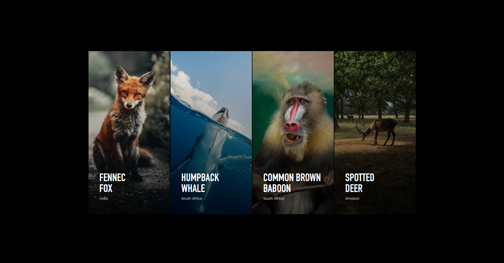
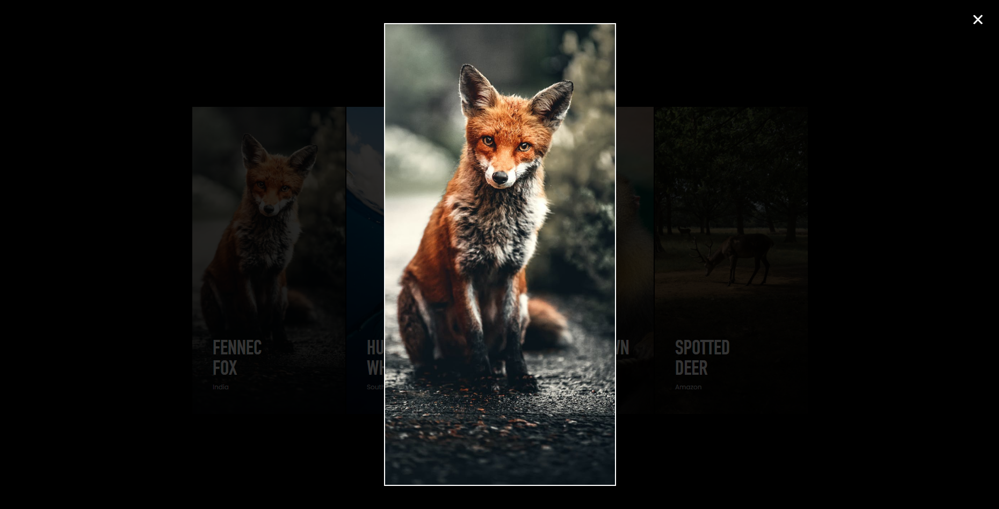

# Photo Gallery
**This is a responsive Photo gallery built with HTML, Pure CSS and Vanilla Javascript.**

**By NISHIMWE RUKUNDO Prosper**

## Description

This website template shows a photo gallery with the following features:
* Thumbnail Preview of all pictures
* Hover animations and Full picture modal
* A user can view a full Image when the Image is **clicked**

## Setup/Preview and Installation guidelines

To view the project's Demo:
* Click on this [Photo Gallery](https://nrprosper.github.io/Code-of-africa-challenge/PhotoGallery/) or
* Paste this link https://nrprosper.github.io/Code-of-africa-challenge/PhotoGallery/ in the browser url to preview the Website demo

To view it locally:
1. Clone the repo
2. `cd` into the repo
3. run `index.html`, Enjoy!

## Built with
* HTML
* CSS
* Javascript
* [Fontawesome](https://fontawesome.com/) for Icons

## Mobile preview

